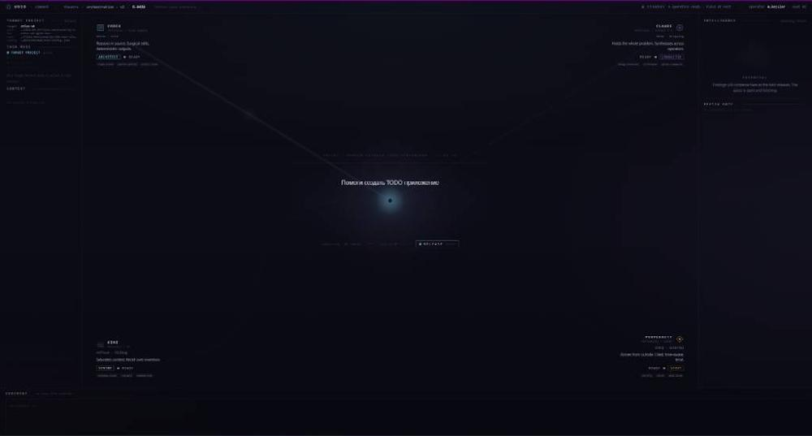

  

# 🌌 VOID — Atlas Dev Hub

**Локальный оркестратор ИИ-агентов и пульт управления разработкой.**

VOID (`atlas-dev-hub`) — это полноценный локальный командный центр (AI Orchestration Engine), созданный для координации независимых ИИ-моделей в единую рабочую экосистему. Проект управляет разработкой основного продукта — локального ассистента **Atlas v0**.

---

## 🚀 Главная концепция системы

Вместо того чтобы работать с нейросетями в обычных чатах, этот оркестратор распределяет задачи между четырьмя специализированными агентами, которые общаются через единую шину данных (`agent bus`) и изолированные рабочие папки (`git worktrees`):

*   **🎙️ CLAUDE (Conductor / Дирижёр):** Удерживает контекст всей проблемы, проводит ревью кода, ищет архитектурные риски и предлагает UI/UX улучшения.
*   **💻 CODEX (Architect / Ведущий разработчик):** Принимает стратегические решения, делает точечные правки кода, запускает тесты и выполняет финальное слияние (`merge`) проверенных фич.
*   **🔍 PERPLEXITY (Scout / Разведчик):** Сканирует интернет, проверяет актуальную документацию библиотек и приносит свежие внешние решения.
*   **🧠 KIMI (Scribe / Аналитик):** Работает с гигантскими объёмами данных, анализирует большие архитектурные планы и дает экспертное «второе мнение».

---

## 🛠️ Что под капотом (Архитектурные фичи)

*   **Безопасность Git Worktrees:** Агенты не ломают основную папку проекта. Для каждого задания создается скрытая изолированная ветка, где ИИ пишет код и запускает сборку (`npm run build`, `cargo check`).
*   **Usage Guard (70-80%):** Встроенный ручной предохранитель токенов. Система мониторит нагрузку сессии и автоматически блокирует тяжелые операции записи, если лимит близок к исчерпанию, оставляя запас на экстренные фиксы.
*   **Полная обсервабилити:** Вывод процессов в реальном времени через `Run Log` по индивидуальным `RUN_ID`, общая лента системных событий и изоляция API-ключей на локальной машине пользователя (`%LOCALAPPDATA%`).

---

## 📦 Стек технологий

*   **Frontend:** React, TypeScript, Tailwind CSS, Vite (с поддержкой Hot-Reload)
*   **Desktop Shell:** Tauri (Rust) для сборки легковесного нативного приложения под Windows
*   **AI Layer:** OpenAI API / Moonshot API / Perplexity API / Claude CLI

---

## 📈 План развития (Next Steps)
1. Добавление вкладки **Live Diff** прямо в интерфейс для визуального контроля правок ИИ перед мерджем.
2. Интеграция шифрования ключей через системный **Windows Credential Manager**.
3. Создание интерактивного дерева процессов и графиков затрат токенов по каждому агенту.
